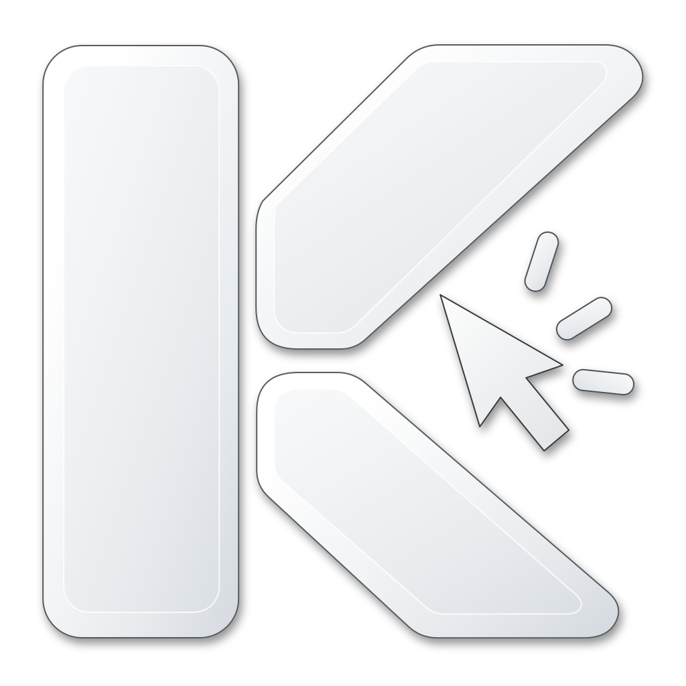

<div align="center">
  <h1 align="center">
    <a href="https://github.com/iamgideonidoko/kact">
      
      <br />
      Kact
    </a>
  </h1>

  <p>
    <a href="https://github.com/iamgideonidoko/kact/releases"></a>
    <a href="https://github.com/iamgideonidoko/kact/blob/main/LICENSE"></a>
    <a href="https://github.com/iamgideonidoko/kact/actions/workflows/check.yml"></a>
  </p>

  <p><b>Keyboard-driven cursor ACTuator</b></p>

  <p align="center">
    <a href="https://iamgideonidoko.github.io/kact/getting-started/installation/">Installation</a> •
    <a href="https://iamgideonidoko.github.io/kact/">Documentation</a> •
    <a href="https://iamgideonidoko.github.io/kact/configuration/overview/">Configuration</a> •
    <a href="https://iamgideonidoko.github.io/kact/reference/cli/">CLI</a> •
    <a href="CONTRIBUTING.md">Contributing</a>
  </p>

  <hr />
</div>

Written in Rust, with native macOS overlays and a local command service.

- Grid labels and accessibility element labels jump directly to targets.
- Freestyle mode provides movement without an overlay.
- Click, double/triple-click, drag, scroll, and jump to screen edges or corners.
- Multiple displays, configurable appearance, and vi/Emacs controls.
- TOML configuration with validation and automatic reload.
- Global shortcuts are **disabled by default**. External shortcut tools can invoke every action through the CLI.

Current support: macOS provides native overlays, accessibility targeting, keyboard capture, and shell actions. Linux X11 provides shell-driven pointer actions. Wayland and Windows backends are not yet available.

## Install

Published binaries are installed from GitHub Releases:

```sh
curl --proto '=https' --tlsv1.2 -fsSL https://raw.githubusercontent.com/iamgideonidoko/kact/main/scripts/install.sh | bash # latest release
kact setup
```

The command installs the latest release. To select a specific tag, use `bash -s -- --version vX.Y.Z` after the pipe. The installer selects the macOS Apple Silicon, macOS Intel, or Linux x86_64 archive, verifies its SHA-256 checksum before installing, writes the executable to `~/.local/bin` by default, and records its installation receipt under `~/.local/state/kact`. Current macOS releases are unsigned and unnotarized, so macOS may ask for confirmation before the first run. See the [installation guide](https://iamgideonidoko.github.io/kact/getting-started/installation/) for source builds, updates, and supported platforms.

## Build from source

Install the pinned Rust 1.88.0 toolchain:

```sh
mise install
cargo install --locked --path .
kact setup
kact status
```

`kact setup` creates the default configuration, opens macOS Accessibility settings when needed, and starts the daemon. After granting permission, rerun `kact setup`. If keyboard capture is denied, check Input Monitoring too. `kact doctor` checks configuration, permission, and service availability without moving the cursor.

For commands, configuration, keyboard controls, integrations, updates, and troubleshooting, use the [documentation site](https://iamgideonidoko.github.io/kact/).

## Roadmap

- Validate real pointer workflows, permissions, sleep/wake, keyboard layouts, displays, remappers, and long-running macOS sessions.
- Measure and publish latency and idle/active resource use.
- Add Developer ID signing and notarization for macOS releases.
- Replace legacy Cocoa bindings before their transitive `block` dependency becomes incompatible with Rust.
- Add `kact config init` presets and generate starter integrations for supported remappers and shells.
- Add window-relative moves and glides for focused-window centers, edges, corners, and fractional positions.
- Add held scrolling with the same normal, precise, and fast speed modes as held pointer movement.
- Extend `kact status` and `kact doctor` with permissions, enabled bindings, display details, and supported capabilities.
- Improve Linux support through explicit, testable capabilities rather than a blanket platform claim.
  - Harden X11 behavior across desktop environments and window managers; report the active session, display, XTest, and available capabilities through `kact doctor`.
  - Add AT-SPI2 accessibility discovery for element targeting where applications expose accessible UI information.
  - Add compositor-specific Wayland profiles, beginning with wlroots-based desktops such as Hyprland, for supported pointer actions.
  - Support opt-in desktop global shortcuts through the XDG portal while keeping command and remapper integrations first-class.
  - Add overlays and advanced input actions only where a compositor supplies a supported native path.
- Add a dedicated native Windows implementation through explicit, testable capabilities.
  - Add pointer movement, clicks, dragging, scrolling, and modified clicks; account for virtual-desktop coordinates, display scaling, and Windows integrity levels.
  - Report the Windows session and available capabilities through `kact doctor`.
  - Support opt-in modifier-based global shortcuts, then active-mode keyboard capture where it is reliable.
  - Add per-display, click-through overlays for grid and element labels.
  - Add UI Automation element targeting where applications expose accessible UI information.
  - Ship Windows x86_64 release archives, a PowerShell installer, per-user startup support, and code signing.
- Add per-app profiles, macros, and a graphical configuration editor.

## Project documentation

- [Contributing](CONTRIBUTING.md), [Code of Conduct](CODE_OF_CONDUCT.md), [support](SUPPORT.md), [security policy](SECURITY.md), and [changelog](CHANGELOG.md)
- [Documentation site](https://iamgideonidoko.github.io/kact/) for installation, configuration, CLI reference, troubleshooting, and contributor guides
- [Documentation source](docs/) for local preview and documentation changes

## License

[MIT](LICENSE).
