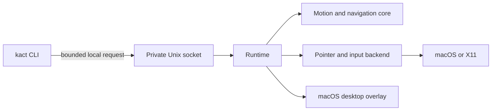

`kact start` launches one background daemon. Its socket prevents a second daemon from claiming the same control path. Action commands send a request to that daemon; `status`, `activate`, `move`, and other actions do not create one automatically.

## Command lifecycle

```sh
kact start              # start one background daemon
kact status             # inspect it
kact move --dx 20       # send an action through its local socket
kact quit               # stop it
```

`start` is safe to repeat. `daemon` runs the same service in the foreground, which is useful while developing or reading logs. `stop` is deliberately narrower: it stops held movement and releases held mouse buttons, while leaving the daemon available for the next command.

## Configuration lifecycle

The daemon loads its configuration once at startup and watches it when `system.hot_reload = true`. A valid change applies atomically and ends an active navigation session to clear held input. An invalid change leaves the previous configuration in use; inspect the daemon log or run `kact config check` to see the problem. Use `kact reload` when automatic reload is disabled.

The runtime uses the same command path for CLI requests and configured bindings. `src/core/` computes movement and label navigation without platform APIs. `src/platform/` injects pointer events and, on macOS, receives keyboard events. `src/desktop/` owns AppKit overlays and accessibility-element discovery on the macOS main thread.

The socket is local, bounded, and owned by the user. Its parent directory must be mode `0700`.

The command socket is not a network API. Use the same `--socket PATH` for a custom daemon and every client that controls it. Passing `--config PATH` to an action command does not change the configuration of a daemon that is already running.
