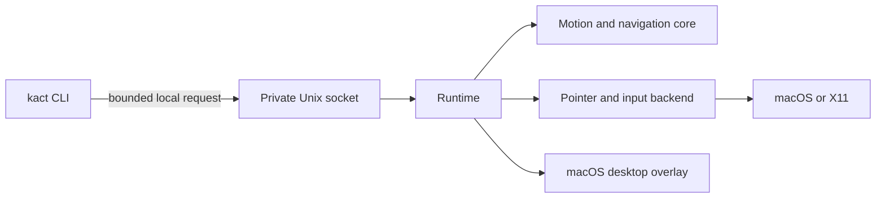

`kact start` launches one background daemon. Its socket prevents a second daemon from claiming the same control path. Action commands send a request to that daemon; `status`, `activate`, `move`, and other actions do not create one automatically.

The runtime uses the same command path for CLI requests and configured bindings. `src/core/` computes movement and label navigation without platform APIs. `src/platform/` injects pointer events and, on macOS, receives keyboard events. `src/desktop/` owns AppKit overlays and accessibility-element discovery on the macOS main thread.

The socket is local, bounded, and owned by the user. Its parent directory must be mode `0700`.
